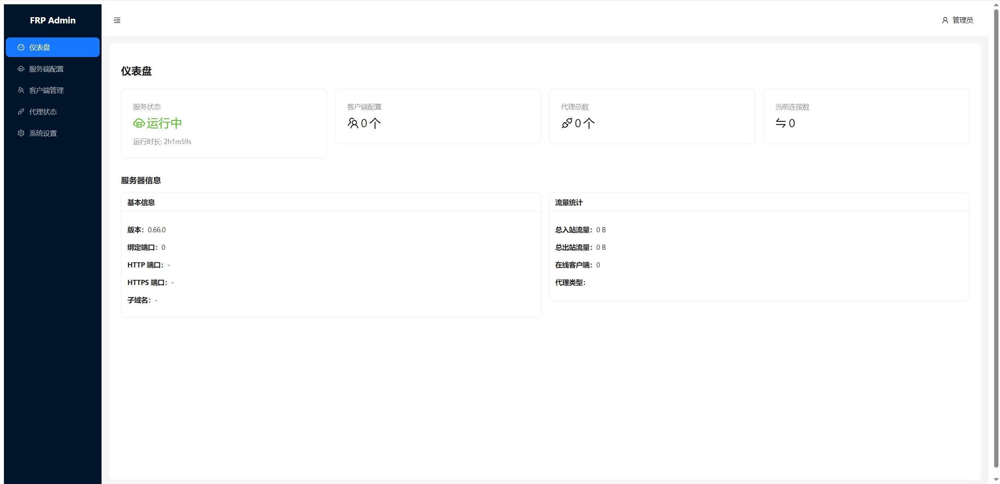
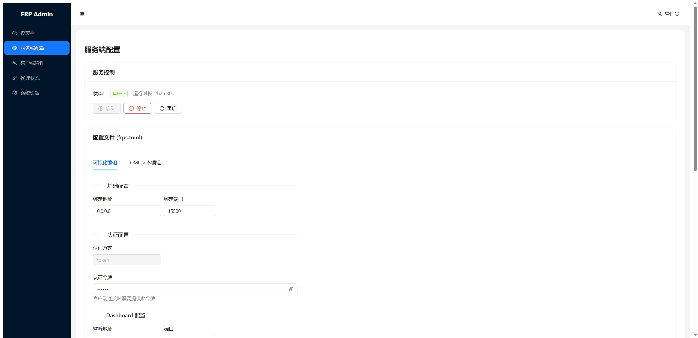
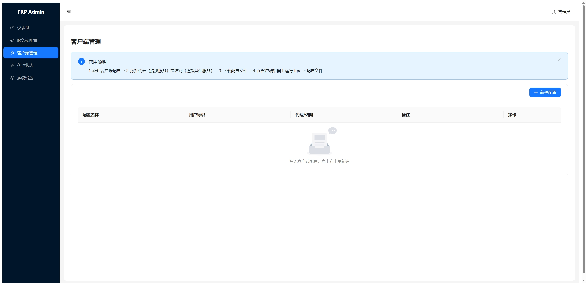

# FRP Admin

[English](#english) | [中文](#中文)

---

## 中文

一个现代化的 FRP (Fast Reverse Proxy) Web 管理面板，提供直观的界面来管理 frps 服务端和 frpc 客户端配置。

### 功能特性

- **服务端管理**
  - 启动/停止/重启 frps 服务
  - 实时查看 frps 运行状态和日志
  - 可视化编辑 frps.toml 配置文件
  - 支持进程管理和 systemctl 两种管理模式

- **客户端管理**
  - 多客户端配置管理
  - 支持 TCP/UDP/STCP/XTCP/SUDP 等代理类型
  - 访问者 (Visitor) 配置支持
  - 端口池管理，自动分配端口
  - 配置验证和一键生成

- **在线管理**
  - 远程热更新 frpc 配置（无需重启）
  - 远程查看 frpc 状态
  - 远程停止 frpc 服务

- **安全特性**
  - JWT 身份认证
  - 登录失败速率限制
  - 首次启动随机生成管理员密码
  - 可配置 CORS 策略

### 截图预览

| 仪表盘 | 服务端配置 | 客户端管理 |
|:---:|:---:|:---:|
|  |  |  |

### 快速开始

#### 环境要求

- Go 1.21+
- Node.js 18+
- frp 0.52.0+（需自行下载 frps/frpc）

#### 编译安装

```bash
# 克隆项目
git clone https://github.com/yourusername/frp-admin.git
cd frp-admin

# 编译
./build.sh

# 运行
./frp-admin
```

首次启动会在控制台输出随机生成的管理员密码，请妥善保存。

#### 配置说明

复制 `backend/.env.example` 为 `.env` 并根据需要修改：

```bash
cp backend/.env.example .env
```

主要配置项：

| 环境变量 | 说明 | 默认值 |
|---------|------|--------|
| FRP_ADMIN_PORT | Web 服务端口 | 8080 |
| FRP_ADMIN_DB | SQLite 数据库路径 | frp_admin.db |
| FRP_ADMIN_SECRET | JWT 密钥 | 自动生成 |
| FRP_ADMIN_FRPS_PATH | frps 二进制路径 | ./frps |
| FRP_ADMIN_FRPS_CONFIG | frps 配置文件路径 | ./frps.toml |
| FRP_ADMIN_FRPS_MANAGER | frps 管理模式 (process/systemctl) | process |
| FRP_ADMIN_CORS_ORIGINS | CORS 允许的来源 | 空 (仅同源) |

详细配置请参考 [backend/.env.example](backend/.env.example)。

### 使用说明

1. **准备 frps/frpc**：从 [fatedier/frp](https://github.com/fatedier/frp/releases) 下载对应版本，放置到 frp-admin 同目录或配置路径

2. **启动服务**：
   ```bash
   ./frp-admin
   ```

3. **访问面板**：浏览器打开 `http://localhost:8080`

4. **配置 frps**：在"服务端配置"页面编辑 frps.toml，启动 frps 服务

5. **添加客户端**：在"客户端管理"页面添加 frpc 配置，下载生成的配置文件到客户端机器运行

### 项目结构

```
frp-admin/
├── backend/          # Go 后端
│   ├── config/       # 配置管理
│   ├── models/       # 数据模型
│   ├── utils/        # 工具函数
│   └── main.go       # 主入口
├── frontend/         # React 前端
│   └── src/
│       ├── api/      # API 封装
│       ├── pages/    # 页面组件
│       └── App.tsx   # 应用入口
├── build.sh          # 编译脚本
└── README.md
```

### 技术栈

**后端**
- Go 1.21
- Gin Web Framework
- GORM + SQLite
- JWT Authentication

**前端**
- React 18
- TypeScript
- Ant Design 5
- Vite

### 常见问题

<details>
<summary>如何修改管理员密码？</summary>

目前需要直接操作数据库：
```bash
sqlite3 frp_admin.db
UPDATE users SET password='新密码的bcrypt哈希' WHERE username='admin';
```
</details>

<details>
<summary>如何使用 systemctl 管理 frps？</summary>

设置环境变量：
```bash
export FRP_ADMIN_FRPS_MANAGER=systemctl
export FRP_ADMIN_FRPS_SERVICE=frps  # systemd 服务名
```
</details>

<details>
<summary>frpc 在线管理如何工作？</summary>

启用在线管理后，frp-admin 会自动为 frpc 配置 webServer，并通过一个 TCP 代理将管理端口映射到 frps，从而实现远程管理。
</details>

### 许可证

[MIT License](LICENSE)

### 致谢

- [fatedier/frp](https://github.com/fatedier/frp) - 优秀的内网穿透工具

---

## English

A modern web-based management panel for FRP (Fast Reverse Proxy), providing an intuitive interface to manage frps server and frpc client configurations.

### Features

- **Server Management**
  - Start/Stop/Restart frps service
  - Real-time frps status and log viewing
  - Visual editing of frps.toml configuration
  - Support for both process and systemctl management modes

- **Client Management**
  - Multi-client configuration management
  - Support for TCP/UDP/STCP/XTCP/SUDP proxy types
  - Visitor configuration support
  - Port pool management with automatic allocation
  - Configuration validation and one-click generation

- **Online Management**
  - Remote hot-reload frpc configuration (no restart needed)
  - Remote frpc status viewing
  - Remote frpc service stop

- **Security Features**
  - JWT authentication
  - Login rate limiting
  - Random admin password on first startup
  - Configurable CORS policy

### Quick Start

#### Requirements

- Go 1.21+
- Node.js 18+
- frp 0.52.0+ (download frps/frpc separately)

#### Build & Install

```bash
# Clone the repository
git clone https://github.com/yourusername/frp-admin.git
cd frp-admin

# Build
./build.sh

# Run
./frp-admin
```

A randomly generated admin password will be displayed on first startup.

#### Configuration

Copy `backend/.env.example` to `.env` and modify as needed:

```bash
cp backend/.env.example .env
```

Key configuration options:

| Variable | Description | Default |
|----------|-------------|---------|
| FRP_ADMIN_PORT | Web server port | 8080 |
| FRP_ADMIN_DB | SQLite database path | frp_admin.db |
| FRP_ADMIN_SECRET | JWT secret | Auto-generated |
| FRP_ADMIN_FRPS_PATH | frps binary path | ./frps |
| FRP_ADMIN_FRPS_CONFIG | frps config file path | ./frps.toml |
| FRP_ADMIN_FRPS_MANAGER | frps management mode | process |
| FRP_ADMIN_CORS_ORIGINS | CORS allowed origins | Empty (same-origin only) |

### Tech Stack

**Backend**: Go, Gin, GORM, SQLite, JWT

**Frontend**: React, TypeScript, Ant Design, Vite

### License

[MIT License](LICENSE)

### Acknowledgments

- [fatedier/frp](https://github.com/fatedier/frp) - An excellent reverse proxy tool
